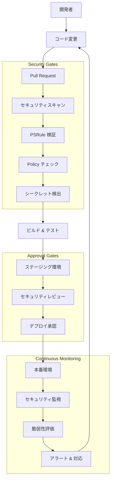

# IaC DevSecOps アーキテクチャ検討書

## 概要

本文書は、Microsoft Learn で定義されている Infrastructure as Code (IaC) の DevSecOps ベースラインアーキテクチャを参照し、当リポジトリの `main.bicep` の妥当性とセキュリティを担保するためのアーキテクチャを検討したものです。

## 目次

1. [Microsoft Learn IaC DevSecOps ベースライン](#microsoft-learn-iac-devsecops-ベースライン)
2. [現在のアーキテクチャ分析](#現在のアーキテクチャ分析)
3. [セキュリティギャップ分析](#セキュリティギャップ分析)
4. [推奨 DevSecOps アーキテクチャ](#推奨-devsecops-アーキテクチャ)
5. [実装ロードマップ](#実装ロードマップ)
6. [継続的監視とコンプライアンス](#継続的監視とコンプライアンス)

---

## Microsoft Learn IaC DevSecOps ベースライン

### 主要コンポーネント

Microsoft Learn で定義されている IaC DevSecOps ベースラインアーキテクチャの主要要素：

#### 1. セキュリティ統合型 CI/CD パイプライン
- **静的コード解析**: Bicep/ARM テンプレートのセキュリティ脆弱性検出
- **ポリシー as コード**: Azure Policy による統制とコンプライアンス
- **シークレット検出**: コード内のハードコードされた認証情報の検出
- **セキュリティテスト**: インフラストラクチャのセキュリティ設定検証

#### 2. インフラストラクチャ検証
- **PSRule for Azure**: Azure リソースのベストプラクティス検証
- **Checkov**: インフラストラクチャコードのセキュリティ分析
- **ARM-TTK**: ARM テンプレートツールキットによる検証
- **カスタムポリシー**: 組織固有のセキュリティ要件検証

#### 3. デプロイメント統制
- **承認ゲート**: 本番環境デプロイメント前の手動承認
- **段階的デプロイメント**: 開発→ステージング→本番の順次デプロイ
- **ロールバック機能**: 問題発生時の自動ロールバック
- **Blue-Green デプロイメント**: ダウンタイムを最小化

#### 4. 継続的監視
- **Security Center**: Azure セキュリティ態勢の継続的評価
- **Sentinel**: セキュリティ情報・イベント管理 (SIEM)
- **Policy Compliance**: ポリシー準拠状況の監視
- **Vulnerability Assessment**: 脆弱性の継続的スキャン

---

## 現在のアーキテクチャ分析

### 現在の構成（main.bicep 解析）

```
main.bicep
├── network.bicep     (VNet, NSG, Application Gateway)
├── keyvault.bicep    (Azure Key Vault + Private Endpoint)  
├── sql.bicep         (Azure SQL Database + Private Endpoint)
├── appInsights.bicep (Application Insights)
└── appService.bicep  (App Service + Managed Identity)
```

### 現在のセキュリティ実装状況

#### ✅ 実装済みのセキュリティ機能

1. **Identity とアクセス管理**
   - Managed Identity の使用
   - Key Vault 統合
   - セキュアパラメータ (`@secure()`) の使用

2. **ネットワークセキュリティ**
   - VNet 統合
   - Private Endpoint 実装
   - Application Gateway (WAF 想定)

3. **データ保護**
   - Key Vault による秘密情報管理
   - SQL Database の分離

4. **基本的な CI/CD**
   - Bicep リンティング
   - What-if 分析
   - OIDC 認証使用

#### ⚠️ 改善が必要な領域

1. **静的セキュリティ分析の不足**
2. **ポリシー as コード の未実装**
3. **包括的なセキュリティテストの不足**
4. **シークレットスキャニングの未実装**
5. **セキュリティベースライン検証の不足**

---

## セキュリティギャップ分析

### 重要度: 高

| ギャップ項目 | 現状 | リスク | 推奨アクション |
|-------------|------|--------|----------------|
| 静的セキュリティ分析 | 未実装 | 設定ミスによる脆弱性 | PSRule, Checkov 導入 |
| シークレット検出 | 未実装 | 認証情報漏洩リスク | GitLeaks, SecretScanner 導入 |
| ポリシー準拠チェック | 未実装 | コンプライアンス違反 | Azure Policy 統合 |
| セキュリティベースライン | 未実装 | セキュリティ設定不備 | CIS Benchmark 適用 |

### 重要度: 中

| ギャップ項目 | 現状 | リスク | 推奨アクション |
|-------------|------|--------|----------------|
| デプロイメント承認 | 未実装 | 未承認デプロイ | Environment Protection Rules |
| ロールバック自動化 | 未実装 | 障害時の手動対応 | 自動ロールバック仕組み |
| セキュリティテスト | 限定的 | 運用時セキュリティ問題 | 自動ペネトレーションテスト |

---

## 推奨 DevSecOps アーキテクチャ

### アーキテクチャ概要図



### 実装コンポーネント

#### 1. セキュリティスキャニング統合

```yaml
# .github/workflows/security-scan.yml (概要)
name: Security Scan
jobs:
  security-analysis:
    steps:
      - name: PSRule for Azure
        uses: microsoft/ps-rule@v2
      - name: Checkov Security Scan  
        uses: bridgecrewio/checkov-action@master
      - name: Secret Detection
        uses: trufflesecurity/trufflehog@main
      - name: ARM-TTK
        uses: aliencube/arm-ttk-actions@v0.3
```

#### 2. Azure Policy 統合

```bicep
// policies/security-baseline.bicep
targetScope = 'subscription'

resource securityPolicy 'Microsoft.Authorization/policySetDefinitions@2021-06-01' = {
  name: 'custom-security-baseline'
  properties: {
    displayName: 'Custom Security Baseline'
    policyDefinitions: [
      {
        policyDefinitionId: '/providers/Microsoft.Authorization/policyDefinitions/0961003e-5a0a-4549-abde-af6a37f2724d' // Key Vault with firewall
      }
      // 追加のポリシー定義
    ]
  }
}
```

#### 3. セキュリティテスト自動化

```bicep
// security-tests.bicep
param environmentName string

module securityTests 'modules/security-tests.bicep' = {
  name: 'security-tests'
  params: {
    targetResourceGroup: environmentName
    testSuites: [
      'network-security'
      'identity-access'
      'data-protection'
      'encryption'
    ]
  }
}
```

---

## 実装ロードマップ

### フェーズ 1: 基盤セキュリティ (1-2週間)

#### 完了基準
- [ ] PSRule for Azure の導入
- [ ] Checkov セキュリティスキャン統合
- [ ] シークレット検出 (GitLeaks/TruffleHog)
- [ ] ARM-TTK テンプレート検証

#### 実装ステップ
1. **GitHub Actions ワークフロー拡張**
   ```bash
   # 新しいワークフローファイル作成
   .github/workflows/security-validation.yml
   ```

2. **PSRule 設定**
   ```yaml
   # ps-rule.yaml
   configuration:
     AZURE_RESOURCE_GROUP: true
     AZURE_SUBSCRIPTION: true
   ```

3. **Checkov 設定**
   ```yaml
   # .checkov.yml  
   framework: bicep
   check: CKV_AZURE_*
   ```

### フェーズ 2: ポリシー統制 (2-3週間)

#### 完了基準
- [ ] Azure Policy テンプレート作成
- [ ] カスタムポリシー定義
- [ ] ポリシー適用自動化
- [ ] コンプライアンス監視

#### 実装ステップ
1. **セキュリティベースラインポリシー**
   - CIS Azure Foundations Benchmark 準拠
   - カスタム組織ポリシー
   - 自動修復アクション

2. **ポリシー as コード実装**
   ```
   policies/
   ├── security-baseline.bicep
   ├── network-policies.bicep  
   ├── identity-policies.bicep
   └── data-protection-policies.bicep
   ```

### フェーズ 3: 高度なセキュリティ機能 (3-4週間)

#### 完了基準
- [ ] デプロイメント承認ゲート
- [ ] 自動脆弱性スキャン
- [ ] セキュリティテスト自動化
- [ ] インシデント対応自動化

#### 実装ステップ
1. **Environment Protection Rules**
   - 本番環境保護設定
   - 承認者設定
   - デプロイ時間制限

2. **継続的セキュリティ監視**
   - Microsoft Defender for Cloud 統合
   - カスタムアラートルール
   - 自動対応アクション

---

## 継続的監視とコンプライアンス

### セキュリティダッシュボード

#### 監視メトリクス
- **脆弱性スコア**: CVE 基準での評価
- **ポリシー準拠率**: Azure Policy 準拠状況
- **セキュリティアラート**: リアルタイム脅威検出
- **アクセス監査**: 特権アクセスの追跡

#### レポート自動化
```powershell
# PowerShell スクリプト例
# security-report.ps1
$compliance = Get-AzPolicyState -All
$vulnerabilities = Get-AzSecurityTask
$recommendations = Get-AzSecurityRecommendation

# レポート生成とアラート
```

### インシデント対応

#### 自動対応アクション
1. **高リスク脆弱性検出**
   - 自動的にセキュリティチーム通知
   - 影響範囲の自動分析
   - 緊急パッチ適用の準備

2. **ポリシー違反検出**
   - リソースの自動修復
   - 違反内容の詳細ログ
   - 責任者への通知

3. **不審なアクティビティ**
   - アクセス制限の自動適用
   - 詳細調査の開始
   - エスカレーション手順の実行

---

## 推奨実装優先順位

### 即座に実装すべき項目（高優先度）
1. **PSRule for Azure** - Bicep テンプレートの基本検証
2. **シークレット検出** - 認証情報漏洩防止
3. **Basic Security Policies** - 最小限のセキュリティ統制

### 短期実装項目（中優先度）
1. **Checkov 統合** - 包括的セキュリティ分析
2. **Environment Protection** - 本番環境保護
3. **セキュリティベースライン** - CIS Benchmark 適用

### 長期実装項目（通常優先度）
1. **高度な監視** - カスタムセキュリティダッシュボード
2. **自動インシデント対応** - 自動修復アクション
3. **ペネトレーションテスト** - 定期的セキュリティ検証

---

## 参考リンク

### Microsoft 公式ドキュメント
- [Azure セキュリティベンチマーク](https://docs.microsoft.com/azure/security/benchmarks/)
- [Azure Policy サンプル](https://docs.microsoft.com/azure/governance/policy/samples/)
- [PSRule for Azure](https://azure.github.io/PSRule.Rules.Azure/)

### セキュリティツール
- [Checkov by Bridgecrew](https://www.checkov.io/)
- [ARM Template Toolkit](https://github.com/Azure/arm-ttk)
- [TruffleHog](https://github.com/trufflesecurity/trufflehog)

### ベストプラクティス
- [Azure Well-Architected Framework](https://docs.microsoft.com/azure/architecture/framework/)
- [Microsoft Cloud Adoption Framework](https://docs.microsoft.com/azure/cloud-adoption-framework/)
- [DevSecOps on Azure](https://docs.microsoft.com/azure/architecture/solution-ideas/articles/devsecops-in-azure)

---

**最終更新**: `date +%Y-%m-%d`
**作成者**: Azure DevSecOps チーム
**版数**: v1.0